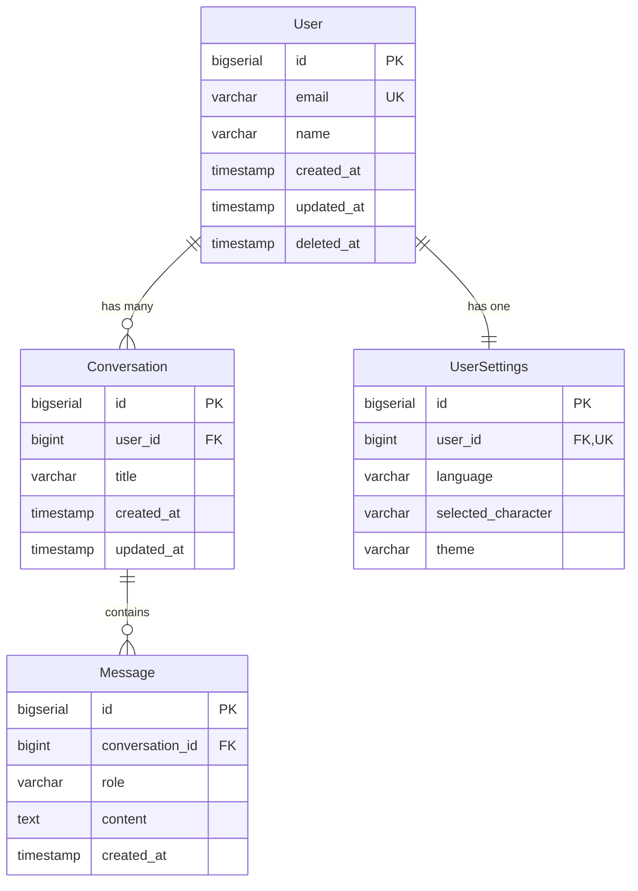

# データモデル仕様

**プロジェクト**: Talk - AI言語学習アプリケーション
**データベース**: Supabase (PostgreSQL 15)
**日付**: 2025-10-18

## エンティティ概要

このデータモデルは、ユーザーとAI間の会話を管理するための4つの主要エンティティで構成されています。

```
┌─────────┐         ┌──────────────┐         ┌─────────┐
│  User   │1──────*│ Conversation │1──────*│ Message │
└─────────┘         └──────────────┘         └─────────┘
     │1
     │
     │*
┌──────────────┐
│ UserSettings │
└──────────────┘
```

---

## 1. User（ユーザー）

### 概要
システムを利用する個人ユーザーを表します。ユーザーは複数の会話を持ち、個人設定を1つ持ちます。

### 属性

| 属性名 | 型 | 制約 | 説明 |
|--------|-----|------|------|
| id | BIGSERIAL | PRIMARY KEY | 一意識別子（自動採番） |
| email | VARCHAR(255) | NOT NULL, UNIQUE | メールアドレス（ログイン用） |
| name | VARCHAR(255) | NOT NULL | ユーザーの表示名 |
| created_at | TIMESTAMP | NOT NULL, DEFAULT CURRENT_TIMESTAMP | アカウント作成日時 |
| updated_at | TIMESTAMP | NOT NULL, DEFAULT CURRENT_TIMESTAMP | 最終更新日時 |
| deleted_at | TIMESTAMP | NULL | 論理削除日時（ソフトデリート） |

### インデックス

```sql
-- 主キー（自動作成）
CREATE INDEX pk_users ON users(id);

-- メールアドレスによる検索（ログイン時）
CREATE INDEX idx_users_email ON users(email);

-- ソフトデリート対応（削除されていないユーザーのみ検索）
CREATE INDEX idx_users_deleted_at ON users(deleted_at) WHERE deleted_at IS NULL;
```

### バリデーションルール

- **email**: 有効なメールアドレス形式
- **name**: 1文字以上、255文字以下
- **email**: 一意性保証（大文字小文字区別なし）

### リレーション

- **Conversations**: 1対多（User → Conversation）
- **UserSettings**: 1対1（User → UserSettings）

### Goモデル定義

```go
type User struct {
    bun.BaseModel `bun:"table:users,alias:u"`

    ID        int64     `bun:"id,pk,autoincrement"`
    Email     string    `bun:"email,notnull,unique"`
    Name      string    `bun:"name,notnull"`
    CreatedAt time.Time `bun:"created_at,nullzero,notnull,default:current_timestamp"`
    UpdatedAt time.Time `bun:"updated_at,nullzero,notnull,default:current_timestamp"`
    DeletedAt time.Time `bun:"deleted_at,soft_delete,nullzero"`

    // Relations
    Conversations []Conversation `bun:"rel:has-many,join:id=user_id"`
    Settings      *UserSettings  `bun:"rel:has-one,join:id=user_id"`
}
```

---

## 2. Conversation（会話）

### 概要
ユーザーとAI間の会話セッションを表します。各会話は複数のメッセージで構成されます。

### 属性

| 属性名 | 型 | 制約 | 説明 |
|--------|-----|------|------|
| id | BIGSERIAL | PRIMARY KEY | 一意識別子（自動採番） |
| user_id | BIGINT | NOT NULL, FOREIGN KEY → users(id) | 会話の所有ユーザー |
| title | VARCHAR(500) | NULL | 会話のタイトル（任意） |
| created_at | TIMESTAMP | NOT NULL, DEFAULT CURRENT_TIMESTAMP | 会話開始日時 |
| updated_at | TIMESTAMP | NOT NULL, DEFAULT CURRENT_TIMESTAMP | 最終更新日時 |

### インデックス

```sql
-- 主キー（自動作成）
CREATE INDEX pk_conversations ON conversations(id);

-- ユーザーIDによる検索（ユーザーの全会話取得）
CREATE INDEX idx_conversations_user_id ON conversations(user_id);

-- 作成日時降順（最新の会話を取得）
CREATE INDEX idx_conversations_created_at ON conversations(created_at DESC);

-- 複合インデックス（ユーザーの会話を日時順で取得）
CREATE INDEX idx_conversations_user_created ON conversations(user_id, created_at DESC);
```

### バリデーションルール

- **user_id**: 有効なユーザーIDを参照
- **title**: 500文字以下（任意）

### リレーション

- **User**: 多対1（Conversation → User）
- **Messages**: 1対多（Conversation → Message）

### カスケード動作

- **ON DELETE CASCADE**: ユーザーが削除されると、その会話も削除

### Goモデル定義

```go
type Conversation struct {
    bun.BaseModel `bun:"table:conversations,alias:c"`

    ID        int64     `bun:"id,pk,autoincrement"`
    UserID    int64     `bun:"user_id,notnull"`
    Title     string    `bun:"title"`
    CreatedAt time.Time `bun:"created_at,nullzero,notnull,default:current_timestamp"`
    UpdatedAt time.Time `bun:"updated_at,nullzero,notnull,default:current_timestamp"`

    // Relations
    User     *User     `bun:"rel:belongs-to,join:user_id=id"`
    Messages []Message `bun:"rel:has-many,join:id=conversation_id"`
}
```

---

## 3. Message（メッセージ）

### 概要
会話内の個別メッセージを表します。ユーザーまたはAIの発言を記録します。

### 属性

| 属性名 | 型 | 制約 | 説明 |
|--------|-----|------|------|
| id | BIGSERIAL | PRIMARY KEY | 一意識別子（自動採番） |
| conversation_id | BIGINT | NOT NULL, FOREIGN KEY → conversations(id) | 所属する会話 |
| role | VARCHAR(20) | NOT NULL, CHECK IN ('user', 'assistant') | メッセージ送信者の役割 |
| content | TEXT | NOT NULL | メッセージ内容 |
| created_at | TIMESTAMP | NOT NULL, DEFAULT CURRENT_TIMESTAMP | メッセージ送信日時 |

### インデックス

```sql
-- 主キー（自動作成）
CREATE INDEX pk_messages ON messages(id);

-- 会話IDによる検索（会話内の全メッセージ取得）
CREATE INDEX idx_messages_conversation_id ON messages(conversation_id);

-- 会話内でのメッセージを時系列順に取得
CREATE INDEX idx_messages_created_at ON messages(conversation_id, created_at);
```

### バリデーションルール

- **conversation_id**: 有効な会話IDを参照
- **role**: 'user' または 'assistant' のみ許可
- **content**: 1文字以上（空メッセージ禁止）

### リレーション

- **Conversation**: 多対1（Message → Conversation）

### カスケード動作

- **ON DELETE CASCADE**: 会話が削除されると、そのメッセージも削除

### Goモデル定義

```go
type Message struct {
    bun.BaseModel `bun:"table:messages,alias:m"`

    ID             int64     `bun:"id,pk,autoincrement"`
    ConversationID int64     `bun:"conversation_id,notnull"`
    Role           string    `bun:"role,notnull"`
    Content        string    `bun:"content,notnull"`
    CreatedAt      time.Time `bun:"created_at,nullzero,notnull,default:current_timestamp"`

    // Relations
    Conversation *Conversation `bun:"rel:belongs-to,join:conversation_id=id"`
}
```

---

## 4. UserSettings（ユーザー設定）

### 概要
ユーザーの個人設定情報を保存します。言語、選択キャラクター、テーマなどのカスタマイズ項目を管理します。

### 属性

| 属性名 | 型 | 制約 | 説明 |
|--------|-----|------|------|
| id | BIGSERIAL | PRIMARY KEY | 一意識別子（自動採番） |
| user_id | BIGINT | NOT NULL, UNIQUE, FOREIGN KEY → users(id) | 設定の所有ユーザー |
| language | VARCHAR(10) | NOT NULL, DEFAULT 'ja' | 表示言語（ja, en, etc） |
| selected_character | VARCHAR(100) | NULL | 選択されたAIキャラクター |
| theme | VARCHAR(20) | DEFAULT 'light' | UIテーマ（light, dark） |

### インデックス

```sql
-- 主キー（自動作成）
CREATE INDEX pk_user_settings ON user_settings(id);

-- ユーザーIDによる検索（UNIQUE制約により自動作成）
CREATE UNIQUE INDEX idx_user_settings_user_id ON user_settings(user_id);
```

### バリデーションルール

- **user_id**: 有効なユーザーIDを参照、1ユーザー1設定のみ
- **language**: 'ja', 'en', 'es', 'fr', 'de', 'zh', 'ko'のいずれか
- **theme**: 'light', 'dark', 'auto'のいずれか

### リレーション

- **User**: 1対1（UserSettings → User）

### カスケード動作

- **ON DELETE CASCADE**: ユーザーが削除されると、その設定も削除

### Goモデル定義

```go
type UserSettings struct {
    bun.BaseModel `bun:"table:user_settings,alias:us"`

    ID                int64  `bun:"id,pk,autoincrement"`
    UserID            int64  `bun:"user_id,notnull,unique"`
    Language          string `bun:"language,notnull,default:'ja'"`
    SelectedCharacter string `bun:"selected_character"`
    Theme             string `bun:"theme,default:'light'"`

    // Relations
    User *User `bun:"rel:belongs-to,join:user_id=id"`
}
```

---

## エンティティ関係図（ER図）



---

## データアクセスパターン

### 主要なクエリパターン

#### 1. ユーザーの全会話を取得（最新順）

```go
var conversations []Conversation
err := db.NewSelect().
    Model(&conversations).
    Where("user_id = ?", userID).
    Relation("User").
    Order("created_at DESC").
    Limit(20).
    Scan(ctx)
```

#### 2. 会話内の全メッセージを取得（時系列順）

```go
var messages []Message
err := db.NewSelect().
    Model(&messages).
    Where("conversation_id = ?", conversationID).
    Order("created_at ASC").
    Scan(ctx)
```

#### 3. ユーザー情報と設定を一括取得

```go
var user User
err := db.NewSelect().
    Model(&user).
    Where("id = ?", userID).
    Relation("Settings").
    Scan(ctx)
```

#### 4. 新しい会話とメッセージを同時作成（トランザクション）

```go
err := db.RunInTx(ctx, nil, func(ctx context.Context, tx bun.Tx) error {
    conversation := &Conversation{
        UserID: userID,
        Title:  "New Conversation",
    }

    if _, err := tx.NewInsert().Model(conversation).Exec(ctx); err != nil {
        return err
    }

    message := &Message{
        ConversationID: conversation.ID,
        Role:           "user",
        Content:        "Hello!",
    }

    if _, err := tx.NewInsert().Model(message).Exec(ctx); err != nil {
        return err
    }

    return nil
})
```

#### 5. メッセージのバルク挿入

```go
messages := []Message{
    {ConversationID: convID, Role: "user", Content: "Message 1"},
    {ConversationID: convID, Role: "assistant", Content: "Response 1"},
    {ConversationID: convID, Role: "user", Content: "Message 2"},
}

_, err := db.NewInsert().
    Model(&messages).
    Exec(ctx)
```

---

## パフォーマンス考慮事項

### インデックス戦略

1. **高頻度検索フィールド**
   - `users.email`: ログイン時の検索
   - `conversations.user_id`: ユーザーの会話一覧取得
   - `messages.conversation_id`: 会話内のメッセージ取得

2. **ソート用インデックス**
   - `conversations.created_at DESC`: 最新会話の取得
   - `messages.created_at ASC`: 時系列メッセージ取得

3. **複合インデックス**
   - `(conversation_id, created_at)`: 会話内メッセージを時系列順で取得
   - `(user_id, created_at)`: ユーザーの会話を日時順で取得

### パーティショニング戦略（将来的な拡張）

メッセージテーブルが大規模になった場合：

```sql
-- 月次パーティショニング（PostgreSQL 12+）
CREATE TABLE messages_partitioned (
    id BIGSERIAL,
    conversation_id BIGINT NOT NULL,
    role VARCHAR(20) NOT NULL,
    content TEXT NOT NULL,
    created_at TIMESTAMP NOT NULL
) PARTITION BY RANGE (created_at);

-- 月ごとのパーティション作成
CREATE TABLE messages_2025_01 PARTITION OF messages_partitioned
    FOR VALUES FROM ('2025-01-01') TO ('2025-02-01');
```

### クエリ最適化

```go
// N+1問題を回避: Relationを使用
var conversations []Conversation
err := db.NewSelect().
    Model(&conversations).
    Where("user_id = ?", userID).
    Relation("Messages"). // 一括でメッセージも取得
    Scan(ctx)

// ページネーション
var conversations []Conversation
err := db.NewSelect().
    Model(&conversations).
    Where("user_id = ?", userID).
    Order("created_at DESC").
    Limit(20).
    Offset(page * 20).
    Scan(ctx)
```

---

## データ整合性

### 制約

1. **外部キー制約**
   - `conversations.user_id` → `users.id`
   - `messages.conversation_id` → `conversations.id`
   - `user_settings.user_id` → `users.id`

2. **一意性制約**
   - `users.email`: 重複メールアドレス禁止
   - `user_settings.user_id`: 1ユーザー1設定のみ

3. **CHECK制約**
   - `messages.role`: 'user' または 'assistant' のみ

### トランザクション分離レベル

```go
// デフォルト: READ COMMITTED
// 必要に応じて変更可能
err := db.RunInTx(ctx, &sql.TxOptions{
    Isolation: sql.LevelSerializable,
}, func(ctx context.Context, tx bun.Tx) error {
    // トランザクション処理
    return nil
})
```

---

## スケーラビリティ計画

### 現在の見積もり（初期フェーズ）

| エンティティ | 月間レコード数 | 1年後の総数 | ストレージ見積もり |
|-------------|---------------|------------|-------------------|
| User        | 1,000         | 10,000     | ~1 MB             |
| Conversation| 10,000        | 120,000    | ~10 MB            |
| Message     | 100,000       | 1,200,000  | ~500 MB           |
| UserSettings| 1,000         | 10,000     | ~1 MB             |

**合計**: 約500 MB（1年後）

### 将来の拡張性

- **読み取りレプリカ**: Supabaseの読み取りレプリカ機能を使用
- **パーティショニング**: Messageテーブルの月次パーティション化
- **アーカイブ戦略**: 古い会話のアーカイブストレージへの移動

---

## バックアップとリカバリ

### Supabase自動バックアップ

- **頻度**: 日次
- **保持期間**: 7日（Proプラン）
- **ポイントインタイムリカバリ**: 7日以内

### 追加対策

```bash
# 週次手動バックアップ
pg_dump $DATABASE_URL > backup_$(date +%Y%m%d).sql

# Supabase CLIを使用
supabase db dump -f backup.sql
```

---

## セキュリティ考慮事項

### 機密データ

- **パスワード**: このモデルには含まれない（Supabase Authを使用）
- **個人情報**: メールアドレスと名前のみ
- **会話内容**: 機密性に応じて暗号化を検討

### Row Level Security (RLS)

```sql
-- ユーザーは自分のデータのみアクセス可能
CREATE POLICY user_policy ON conversations
    FOR ALL
    USING (user_id = auth.uid());

CREATE POLICY message_policy ON messages
    FOR ALL
    USING (
        conversation_id IN (
            SELECT id FROM conversations WHERE user_id = auth.uid()
        )
    );
```

---

## まとめ

このデータモデルは以下の要件を満たします：

✅ **ユーザー管理**: アカウント情報の永続化
✅ **会話履歴**: 時系列での会話保存
✅ **ユーザー設定**: 個人設定の永続化
✅ **スケーラビリティ**: 適切なインデックス設計
✅ **データ整合性**: 外部キーとCHECK制約
✅ **パフォーマンス**: クエリ最適化とパーティショニング戦略

---

**ドキュメントバージョン**: 1.0
**最終更新**: 2025-10-18
